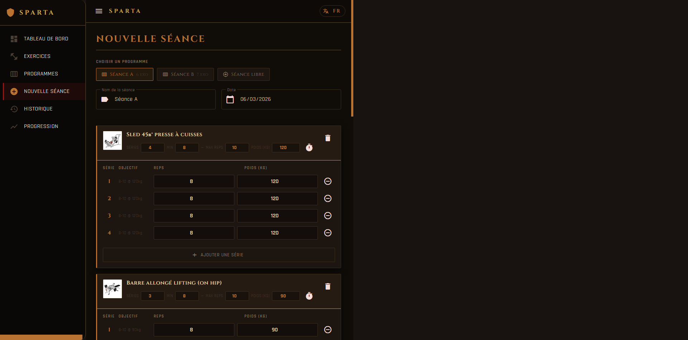
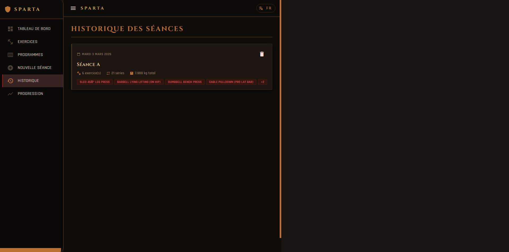
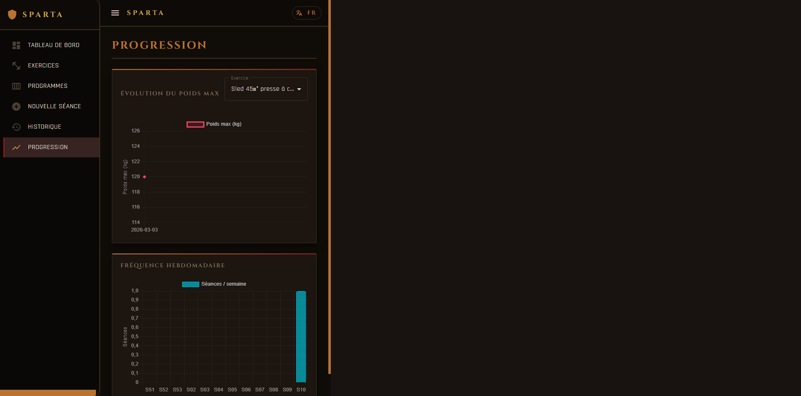

# Sparta — Workout Tracker

Application web de suivi sportif construite avec Angular 19 et Angular Material.

## Screenshots

### Tableau de bord


### Nouvelle séance


### Programmes


### Bibliothèque d'exercices


### Historique


### Progression


## Fonctionnalités

- **Tableau de bord** — stats rapides (séances totales, ce mois-ci, dernière séance)
- **Programmes** — templates de séance avec exercices, séries et fourchettes de reps/poids ; overload progressif automatique
- **Bibliothèque d'exercices** — catalogue via l'API Wger avec GIFs animés, recherche bilingue FR/EN, filtres par groupe musculaire
- **Logger une séance** — depuis un template ou libre, tableau séries/reps/poids, support exercices à durée (planches, etc.)
- **Historique** — liste de toutes les séances passées avec détail
- **Progression** — graphiques d'évolution du poids max et de la fréquence hebdomadaire
- **Bilingue** — interface FR / EN

## Stockage des données

Les données sont stockées **localement dans le navigateur** via **IndexedDB**.

- Aucun compte, aucun serveur, aucune inscription requise
- Les données restent sur l'appareil et le navigateur de l'utilisateur
- Chaque visiteur part avec une base vide — les programmes et séances ne sont pas partagés entre utilisateurs
- Pour retrouver ses données sur un autre appareil, il faudrait une fonctionnalité d'export/import (à venir)

## Stack technique

- Angular 19 (standalone components + Signals)
- Angular Material 19 (dark theme)
- Chart.js (graphiques de progression)
- IndexedDB via `idb` (stockage local, sans backend)
- API Wger (https://wger.de) — gratuite, sans clé API

## Développement local

```bash
npm install
ng serve
# → http://localhost:4200
```

## Build

```bash
ng build
```

## Déploiement GitHub Pages

```bash
ng build --base-href=/Sparta/
npx angular-cli-ghpages --dir=dist/sparta/browser
```
